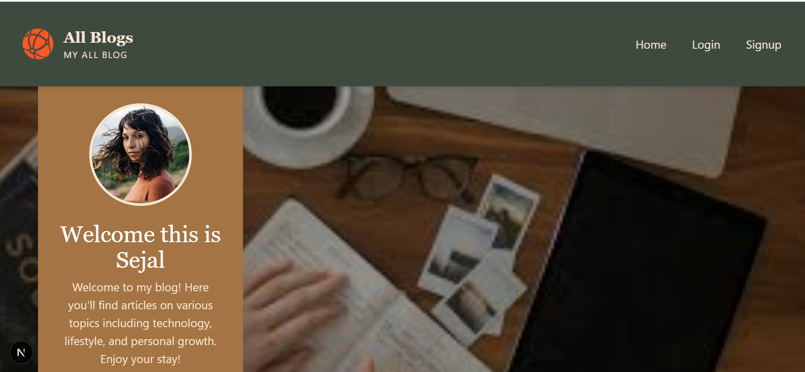
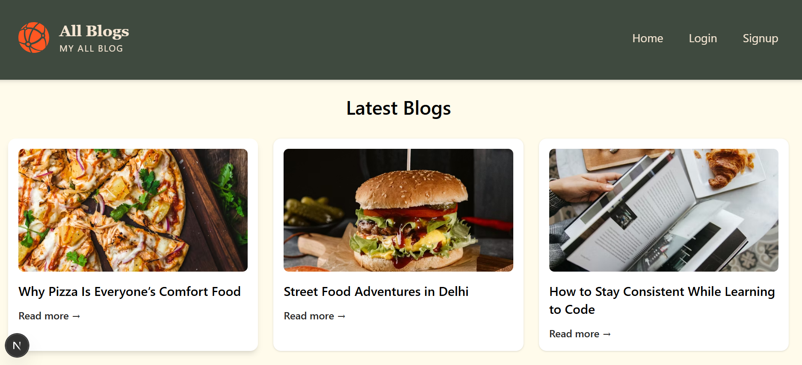
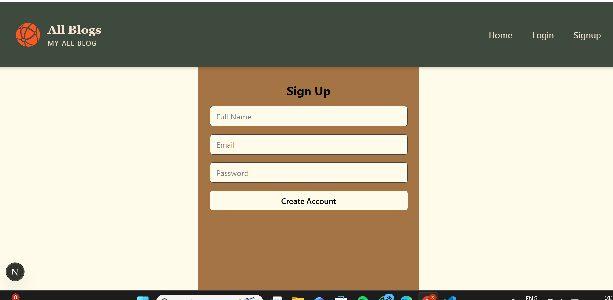
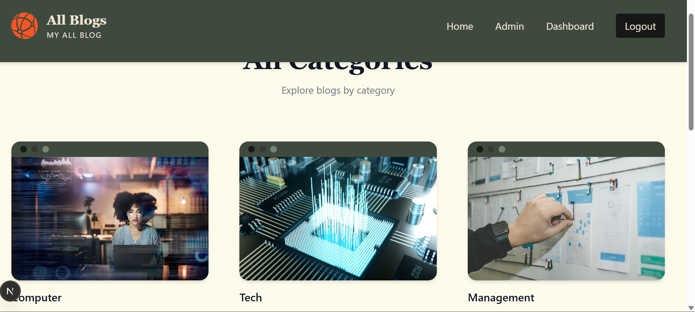
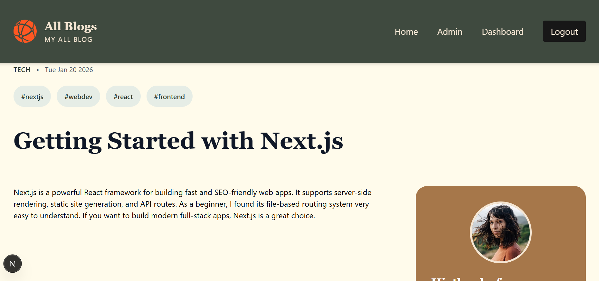
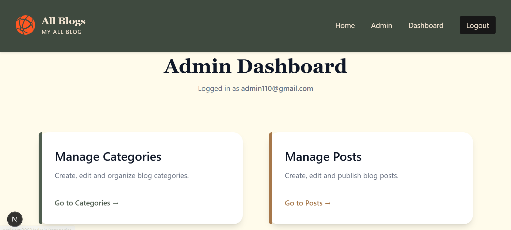
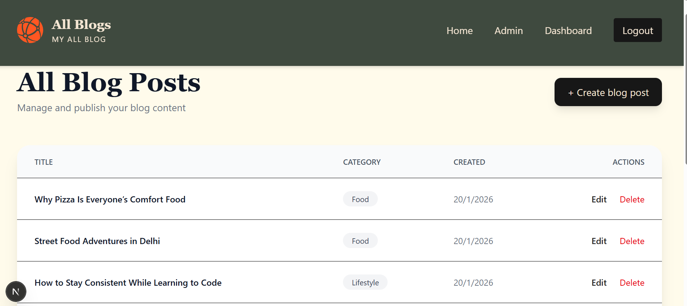

📝 Blog Website – Full Stack (Next.js + Prisma + Neon)

A modern, full-stack blog platform built with Next.js App Router, Prisma, and Neon PostgreSQL, featuring role-based authentication, an admin dashboard, and category-based blogging with clean routing and revalidation.

🚀 Features                                                                                                                 
🌐 Public

Home page with:

Featured categories

Recent blog posts

Category-wise blog browsing

Single blog post page

SEO-friendly dynamic routes

Responsive UI

👤 Authentication

User registration & login

Protected dashboard pages

Role-based access control (Admin / User)

📊 Dashboard (User)

View all blog categories

Browse posts by category

Search blogs by category

Clean, dashboard-style UI

🛠️ Admin Panel

Secure admin-only access

Create & manage categories

Create, edit, and delete blog posts

Assign categories to posts

Automatic page revalidation after content updates

🧠 Website Flow
HOME (/)                                                                                                                     
 ├─ Click featured category → /dashboard/[category]                                                                          
 ├─ Click "Show all categories" → /dashboard                                                                                 
 └─ Click recent post → /blog/post/[slug]                                                                                    
                                                                                                                             
/dashboard                                                                                                                   
 └─ Click category → /dashboard/[category]                                                                                   

/dashboard/[category]                                                                                                        
 └─ Click post → /blog/post/[slug]                                                                                           

🧑‍💻 Tech Stack

Frontend: Next.js (App Router), React, Tailwind CSS

Backend: Next.js Server Actions

Database: PostgreSQL (Neon)

ORM: Prisma

Authentication: Custom auth (role-based)

Deployment Ready: Vercel-compatible

🔐 Roles & Access
Role	Access
User	View blogs, categories, dashboard
Admin	Create/edit/delete posts & categories

🧩 Upcoming Improvements

Latest blogs section on home page

Advanced search (title + content)

Pagination / infinite scroll

Rich text editor for posts

Image upload (Cloudinary / UploadThing)

Draft & publish system

Comments & likes

⚙️ Setup (Local)
git clone <repo-url>
cd blog-website
pnpm install

Create .env file:

DATABASE_URL=your_neon_db_url
NEXTAUTH_SECRET=your_secret

Run migrations:

npx prisma migrate dev

Start dev server:

pnpm run dev

📬 Author

Sejal Singh
Full Stack Developer | Next.js | Django

## 📸 Screenshots

### 🏠 Home Page
 

### Sign In

### 📂 Category Page

### 📝 Blog Post

### 🛠️ Admin Dashboard

### ✍️ Create Post

